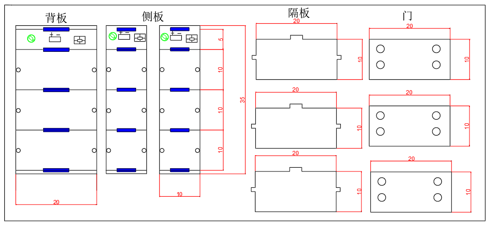

**柜子尺寸设计**



**树莓派GPIO硬件接口图：**


**定义GPIO控制接口：**

|  锁1   |  锁2   |  锁3   |
| :----: | :----: | :----: |
| GPIO17 | GPIO27 | GPIO22 |

**电路接线图：**


**完整接线图**


***控制程序***

**miscopython**

```python
import RPi.GPIO as GPIO
import time

GPIO.setmode(GPIO.BCM)
GPIO.setup(17, GPIO.OUT) #锁1
GPIO.setup(27, GPIO.OUT) #锁2
GPIO.setup(22, GPIO.OUT) #锁3
GPIO.output(17, GPIO.HIGH)
time.sleep(0.1)
GPIO.output(17, GPIO.LOW)    
GPIO.cleanup(17)
```

**二维码识别**

```python
# 动态识别二维码，并打印结果
import sys
import numpy as np
import cv2

cap = cv2.VideoCapture(0)  # 设备号为0
cap.set(cv2.CAP_PROP_FOURCC, cv2.VideoWriter_fourcc('M', 'J', 'P', 'G'))
cap.set(cv2.CAP_PROP_FRAME_WIDTH, 640)
cap.set(cv2.CAP_PROP_FRAME_HEIGHT, 480)

while (True):
    if cap.isOpened() == False:
        print('can not open camera')
        break
    else:
        ret, frame = cap.read()  # 读取图像
        inputImage = frame

        #使用函数cv2.QRCodeDetector().detectAndDecode（）获取二维码的内容data并截取展示二维码的部分rectifiedImage
        data, bbox, rectifiedImage = cv2.QRCodeDetector().detectAndDecode(inputImage)
        if len(data) > 0:
            print("Decoded Data : {}".format(data))   #打印识别到的数据
            rectifiedImage = np.uint8(rectifiedImage)
            cv2.namedWindow("Results", cv2.WINDOW_AUTOSIZE)
            rectifiedImage = cv2.resize(rectifiedImage, (300, 300))
            cv2.imshow("Results", rectifiedImage)
        else:
            print("QR Code not detected")
            cv2.namedWindow('Rectified QRCode')
            cv2.imshow("Rectified QRCode", inputImage)
        mykey = cv2.waitKey(1)
        if mykey & 0xFF == ord('q'):
            #释放内存、关闭窗口、退出进程
            cap.release()
            cv2.destroyAllWindows()
            sys.exit(0)

    if ret == False:  # 图像读取失败则直接进入下一次循环
        continue
```

**识别三个二维码的信息并存入data文件**

```python
#QR_read_save
# 动态识别二维码，并打印结果
import sys
import numpy as np
import cv2

cap = cv2.VideoCapture(0)  # 设备号为0
cap.set(cv2.CAP_PROP_FOURCC, cv2.VideoWriter_fourcc('M', 'J', 'P', 'G'))
cap.set(cv2.CAP_PROP_FRAME_WIDTH, 640)
cap.set(cv2.CAP_PROP_FRAME_HEIGHT, 480)

while (True):
    if cap.isOpened() == False:
        print('can not open camera')
        break
    else:
        ret, frame = cap.read()  # 读取图像
        inputImage = frame

        #使用函数cv2.QRCodeDetector().detectAndDecode（）获取二维码的内容data并截取展示二维码的部分rectifiedImage
        data, bbox, rectifiedImage = cv2.QRCodeDetector().detectAndDecode(inputImage)
        if len(data) > 0:
            print("Decoded Data : {}".format(data))   #打印识别到的数据
            rectifiedImage = np.uint8(rectifiedImage)
            cv2.namedWindow("Results", cv2.WINDOW_AUTOSIZE)
            rectifiedImage = cv2.resize(rectifiedImage, (300, 300))
            cv2.imshow("Results", rectifiedImage)
        else:
            print("QR Code not detected")
            cv2.namedWindow('Rectified QRCode')
            cv2.imshow("Rectified QRCode", inputImage)
        mykey = cv2.waitKey(1)
        if mykey & 0xFF == ord('q'):
            #释放内存、关闭窗口、退出进程
            cap.release()
            cv2.destroyAllWindows()
            sys.exit(0)

    if ret == False:  # 图像读取失败则直接进入下一次循环
        continue
```

```python
#package_get.py
# 动态识别二维码，并打印结果
import sys
import numpy as np
import cv2
#import RPi.GPIO as GPIO
import time
#GPIO.setmode(GPIO.BCM)
#GPIO.setup(17, GPIO.OUT) #锁1

cap = cv2.VideoCapture(0)  # 设备号为0
cap.set(cv2.CAP_PROP_FOURCC, cv2.VideoWriter_fourcc('M', 'J', 'P', 'G'))
cap.set(cv2.CAP_PROP_FRAME_WIDTH, 640)
cap.set(cv2.CAP_PROP_FRAME_HEIGHT, 480)
cap.set(cv2.CAP_PROP_FPS, 10)
def compare(data):
    filenew = open(r"user.txt", "w", encoding="utf8")
    filenew.write(data)
    file = open(r"user1.txt", "r", encoding="utf8")
    filenew = open(r"user.txt", "r", encoding="utf8")
    message=file.read()  # 将识别到的信息存入
    messagenew=filenew.read()
    if messagenew==message
        GPIO.output(17, GPIO.HIGH)
        time.sleep(0.1)
        GPIO.output(17, GPIO.LOW)
        GPIO.cleanup(17)

while (True):
    if cap.isOpened() == False:
        print('can not open camera')
        break
    else:
        ret, frame = cap.read()  # 读取图像
        inputImage = frame

        #使用函数cv2.QRCodeDetector().detectAndDecode（）获取二维码的内容data并截取展示二维码的部分rectifiedImage
        data, bbox, rectifiedImage = cv2.QRCodeDetector().detectAndDecode(inputImage)
        if len(data) > 0:
            print("Decoded Data : {}".format(data))
            compare(data)     #将读入的信息存入txt中
            rectifiedImage = np.uint8(rectifiedImage)
            cv2.namedWindow("Results", cv2.WINDOW_AUTOSIZE)
            rectifiedImage = cv2.resize(rectifiedImage, (300, 300))
            cv2.imshow("Results", rectifiedImage)
        else:
            print("QR Code not detected")
            cv2.namedWindow('Rectified QRCode')
            cv2.imshow("Rectified QRCode", inputImage)

        mykey = cv2.waitKey(1)
        if mykey & 0xFF == ord('q'):
            #释放内存、关闭窗口、退出进程
            cap.release()
            cv2.destroyAllWindows()
            sys.exit(0)

    if ret == False:  # 图像读取失败则直接进入下一次循环
        continue
```

参考文献：

[(20条消息) 树莓派实现继电器控制电磁锁_继电器驱动电磁锁_捞仔程序猿的博客-CSDN博客](https://blog.csdn.net/Dassel/article/details/124226051?ops_request_misc=&request_id=&biz_id=102&utm_term=树莓派控制电磁锁&utm_medium=distribute.pc_search_result.none-task-blog-2~all~sobaiduweb~default-0-124226051.nonecase&spm=1018.2226.3001.4187)

[(20条消息) Liunx树莓派(ARM)开发篇—第七章、树莓派控制继电器（附代码）_阿波罗啦啦啦啦的博客-CSDN博客](https://blog.csdn.net/weixin_44933419/article/details/113773136?ops_request_misc=&request_id=&biz_id=102&utm_term=树莓派控制电磁锁&utm_medium=distribute.pc_search_result.none-task-blog-2~all~sobaiduweb~default-3-113773136.nonecase&spm=1018.2226.3001.4187)

[(20条消息) 树莓派GPIO控制--python篇_树莓派pythongpio库_bingo_2021的博客-CSDN博客](https://blog.csdn.net/hu7850/article/details/51785594/?ops_request_misc=&request_id=&biz_id=102&utm_term=树莓派miscopython控制电磁锁&utm_medium=distribute.pc_search_result.none-task-blog-2~all~sobaiduweb~default-3-51785594.142^v84^insert_down1,239^v2^insert_chatgpt&spm=1018.2226.3001.4187)