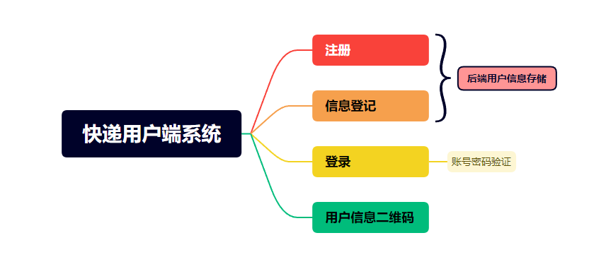
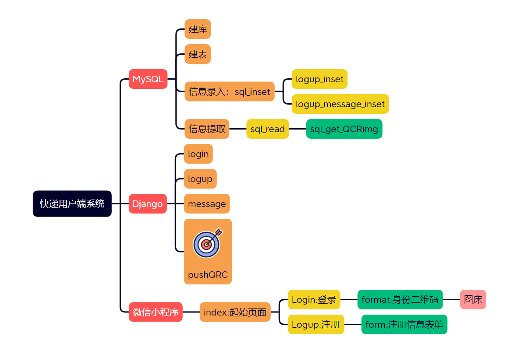
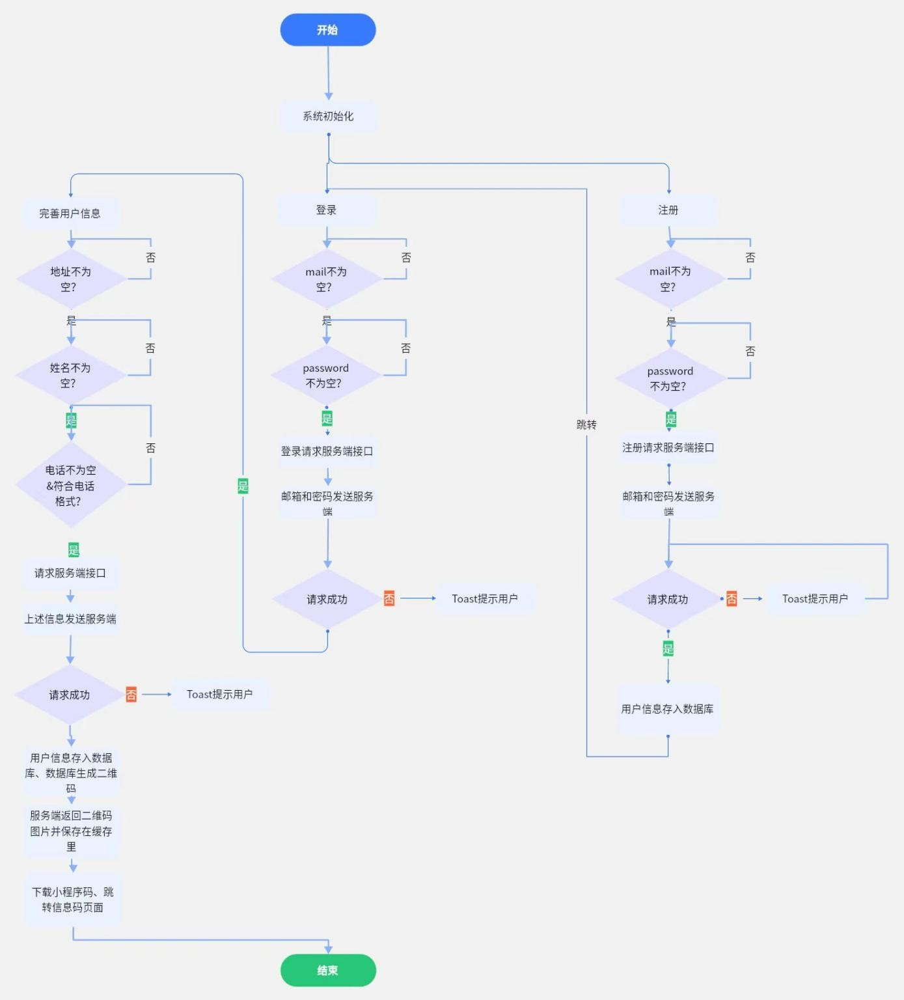
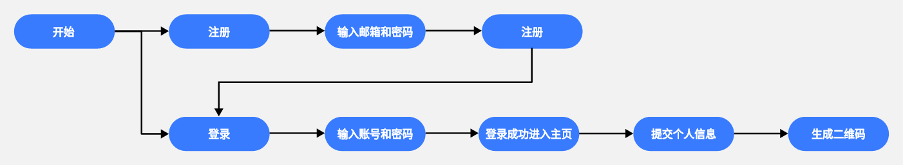

Django的启动：

```python
cd .\tango_with_django_project\ 
python manage.py runserver 
```

Django新应用的添加

```python
python manage.py startapp 应用名
注意：使用命令行创建的应用，一定要在 settings.py-->INSTALLED_APPS 中加入你的应用名字进行注册, 使用Pycharm创建的应用则不用。

```

APP文件目录


**设计思路**

该小程序包括注册页面，用户信息登记页面，登陆页面，身份码页面。




**程序结构设计图**

通过微信小程序与用户之间进行交互，完成用户注册登录、用户信息收集和二维码的显示；后端采用python的开放[源代码](https://baike.baidu.com/item/源代码/3814213?fromModule=lemma_inlink)的Web应用框架，并将用户信息存入MySQL数据库中。



**程序逻辑流程图**

实现逻辑包括以下几个方面：

（1）用户登录和注册：用户输入手机号码进行注册和登录，系统会验证手机号码的合法性，并将用户信息存储在数据库中。

（2）个人信息二维码显示和识别：系统会根据用户的个人信息生成二维码，并在个人信息页面中显示。用户可以通过扫描二维码进行快递签收，系统会根据二维码中的信息进行快递签收操作。

（3）快递下单和查询：用户输入快递信息进行下单，系统会将快递信息存储在数据库中，并生成订单号。用户可以在订单页面中查看订单状态和历史记录。

（4）快递签收：用户可以通过扫描快递上的二维码进行签收，系统会根据二维码中的信息进行快递签收操作，并更新订单状态。




**业务逻辑图**




```
登记注册邮箱和密码

登记注册个人信息生成QRC码，上传QRC码到图床，将返回的url登记

验证登录密码，正确则将url传给前端
```

